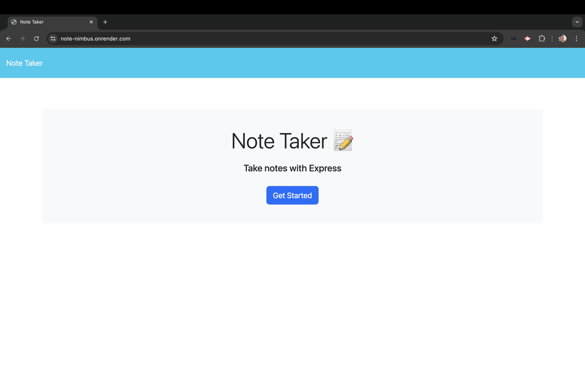
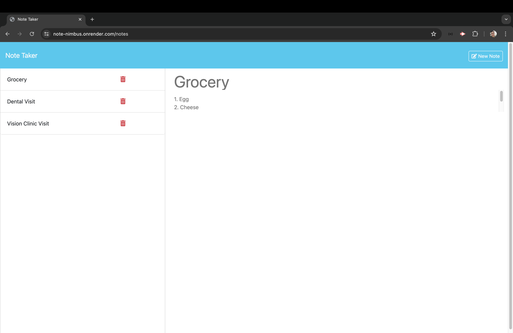
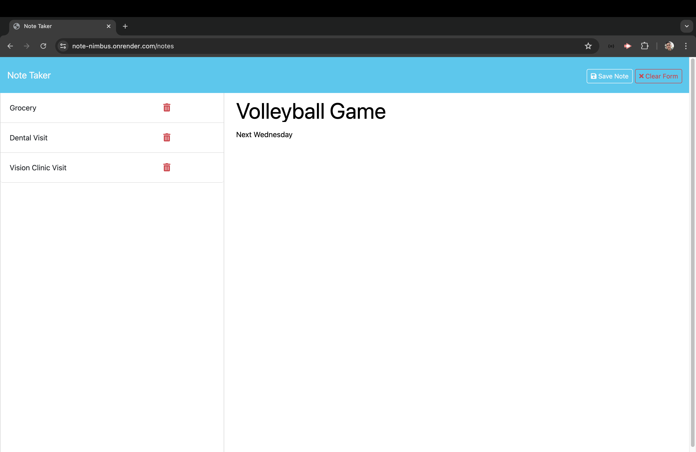

# Note Nimbus

[](https://github.com/Thecaprifire)
[](https://choosealicense.com/licenses/mit/)
  
## Description:
The Note Nimbus is a dynamic note-taking application built with Express.js, designed for effortless writing and saving of notes. It leverages a JSON file for efficient data storage and retrieval, ensuring your thoughts are always accessible and organized.

 ## Table of Contents
  * [Description](#description)
  * [The Challenge](#the-challenge)
  * [User Story](#user-story)
  * [Acceptance Criteria](#acceptance-criteria)
  * [Installation Process](#installation-process)
  * [Usage Instructions](#usage-instructions)
  * [Walkthrough Video](#walkthrough-video)
  * [Actual Website](#actual-website)
  * [Screenshots](#screenshots)
  * [Resources](#resources)
  * [Questions](#questions)
  * [License](#license)

## The Challenge:
Create an application called Note Taker to write and save notes using an Express.js backend, storing and retrieving note data from a JSON file.


## User Story
```md
AS A busy person
I WANT to be able to write and save notes
SO THAT I can organize my thoughts and keep track of tasks I need to complete
```

## Acceptance Criteria
```md
GIVEN a note-taking application
WHEN I open the Note Taker
THEN I am presented with a landing page with a link to a notes page
WHEN I click on the link to the notes page
THEN I am presented with a page with existing notes listed in the left-hand column, plus empty fields to enter a new note title and the note’s text in the right-hand column
WHEN I enter a new note title and the note’s text
THEN a "Save Note" button and a "Clear Form" button appear in the navigation at the top of the page
WHEN I click on the Save button
THEN the new note I have entered is saved and appears in the left-hand column with the other existing notes and the buttons in the navigation disappear
WHEN I click on an existing note in the list in the left-hand column
THEN that note appears in the right-hand column and a "New Note" button appears in the navigation
WHEN I click on the "New Note" button in the navigation at the top of the page
THEN I am presented with empty fields to enter a new note title and the note’s text in the right-hand column and the button disappears
```

## Installation Process
1. Clone the repository: [Note Nimbus](https://github.com/Thecaprifire/note-nimbus)
2. Install the following:
- Node.JS [Version 20.14.0](https://nodejs.org/en/blog/release/v20.14.0/) 
- Express [Version 4.16.4](https://www.npmjs.com/package/express/v/4.16.4)
- UUID: [Version 3.4.0](https://www.npmjs.com/package/uuid/v/3.4.0?activeTab=versions)
3. Open the cloned repository in any source code editor.
4. Open the integrated terminal for the document and complete the respective installation guides provided above in section (2.) to ensure the cloned documentation will operate.


## Usage Instructions
1.	Open the cloned repository in your preferred source code editor (e.g., Visual Studio Code).
2.	Navigate to the directory containing server.js.
3.	Open an integrated terminal and run node server.js.
4.	Access the application by opening your web browser and navigating to http://localhost:3000.
5.	You will then be presented with a landing page that contains the notes page, where you can create, view, save, and clear notes.


## Walkthrough Video:
[Click Here to Watch](https://youtu.be/sv7BrslOOwE?si=ES1h9TzQtAuHhy4f)

## Actual Website:
[Note Nimbus](https://note-nimbus.onrender.com)

## Screenshots:
### Figure 1.
 
### Figure 2.

### Figure 3.


## Resources
- Dynamic JavaScript
- Node.js [Version 20.14.0](https://nodejs.org/en/blog/release/v20.14.0/)
- Express.js [Version 4.16.4](https://www.npmjs.com/package/express/v/4.16.4)
- UUID: [Version 3.4.0](https://www.npmjs.com/package/uuid/v/3.4.0?activeTab=versions)
- Render Deployment [Render](https://render.com/)
- License Badge: [Shields.io](https://shields.io/)
- Visual Studio Code: [Website](https://code.visualstudio.com/)

  
## Questions
  Contact the author with any questions!<br>
  Github link: [Thecaprifire](https://github.com/Thecaprifire)<br>
  Email: ianjandaluz@gmail.com


## License
  This project is [MIT](https://choosealicense.com/licenses/mit/) licensed.<br />

  Copyright © 2024 [JAN IAN DALUZ](https://github.com/Thecaprifire)
  
  <hr>
  <p align='center'><i>
  Here’s to your coding journey! 🎉 JAN IAN DALUZ
  </i></p>